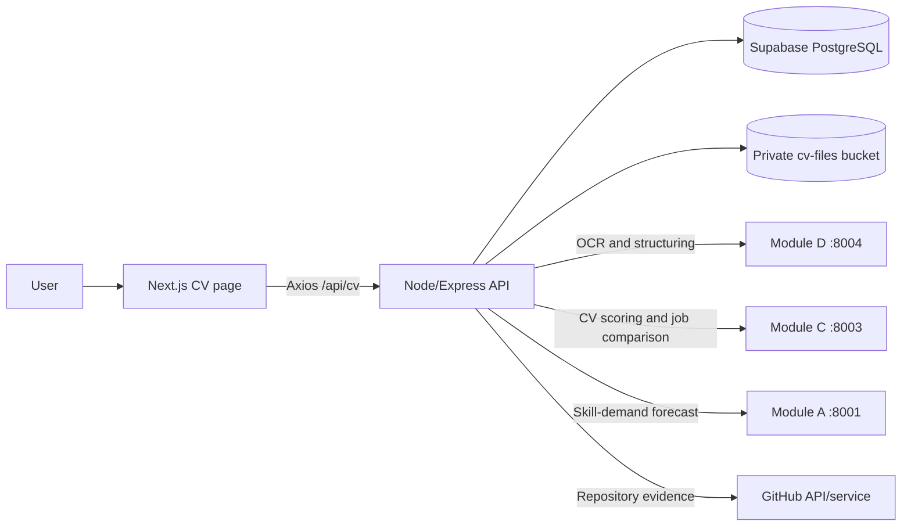
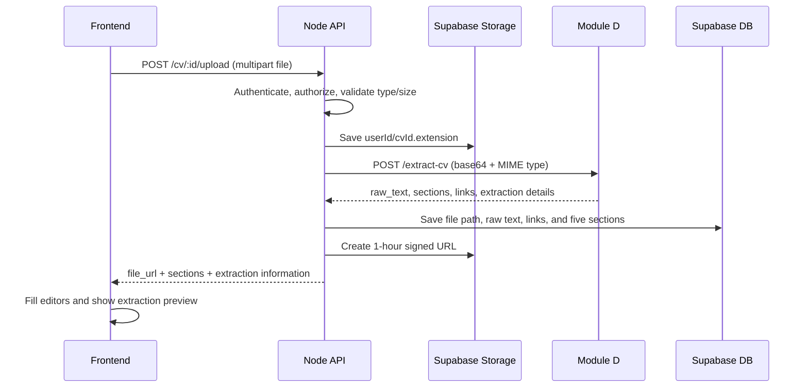

# CV Analyzer — Complete Technical and Data-Flow Documentation

## 1. Purpose

The CV Analyzer helps a signed-in user create, upload, edit, analyze, and compare a CV. It combines the Next.js frontend, Node/Express backend, Supabase database and storage, and three Python services.

The module provides:

- CV record management
- PDF, DOCX, PNG, JPG, and TXT upload (maximum 10 MB)
- OCR and structured field extraction
- editable summary, experience, education, skills, and project sections
- ATS-quality scoring
- skill extraction and proficiency labels
- job-role matching against curated role profiles
- missing-skill recommendations
- GitHub project verification
- comparison with a real job advertisement
- missing-skill market-demand information
- AI-assisted CV-tailoring suggestions

The main user page is `frontend/src/app/(dashboard)/cv/page.tsx`.

---

## 2. System architecture



Responsibilities:

| Layer | Responsibility |
|---|---|
| Frontend | Collect input, call the API, keep temporary page state, and render results |
| Node backend | Authenticate, authorize, validate, orchestrate services, and persist data |
| Supabase Database | Store CV metadata, structured sections, matches, suggestions, and job comparisons |
| Supabase Storage | Store the original CV file privately |
| Module D | Extract text/sections using OCR and generate job-specific tailoring advice |
| Module C | Extract known skills, calculate ATS quality, predict job fit, and identify gaps |
| Module A | Add predicted market demand to missing skills |
| GitHub service | Verify whether claimed projects and technologies have repository evidence |

---

## 3. Frontend page structure

The page has three main tabs.

### 3.1 My CVs

This tab shows:

- number of CVs created
- best stored match score
- number of analyzed CVs
- one card for every CV
- buttons to create, edit, analyze, or delete a CV

Data source: `GET /api/cv`.

Frontend state: `cvList`.

### 3.2 CV Editor

This tab contains:

- CV title
- upload control
- original uploaded-file viewer
- GitHub and LinkedIn URLs
- summary editor
- experience editor
- education editor
- skills editor with four categories
- projects editor
- Save and Analyze buttons

Data sources:

- `GET /api/cv/:id` when a CV is selected
- `POST /api/cv/:id/upload` after a file is selected
- local React state while the user edits

The original file is displayed using the one-hour signed `file_url`. Images use an `` element; other supported documents use an `<iframe>`.

### 3.3 Analysis

This tab displays:

- top-three-match average chart
- ATS score chart
- extracted skill chips
- up to five ranked job-role cards
- missing skills for each role
- GitHub-verified skill results returned by Module C
- improvement suggestions with an Apply action
- separate GitHub project-verification panel
- real job-post comparison panel

Primary data source: `POST /api/cv/:id/analyze`.

Stored results are reconstructed from `GET /api/cv/:id` when the CV is reopened.

---

## 4. Important frontend state

| State | Meaning | Filled from |
|---|---|---|
| `cvList` | Summary list of the user's CVs | `listCVs()` |
| `selected` | Current CV plus sections and saved results | `getCV(id)` |
| `structuredSections` | Editable normalized CV content | saved sections or upload result |
| `cvMeta` | title, GitHub URL, LinkedIn URL, and summary metadata | selected CV and user edits |
| `analysis` | Current analysis response | `analyzeCV()` or reconstructed stored data |
| `extractionPreview` | OCR quality and extracted-item counts | upload response |
| `projVerification` | GitHub project verification result | selected CV or verification response |
| `jobPosts` | Saved real-job comparisons | `getCV(id)` and attach/delete actions |
| `loading`, `saving`, `uploading`, `analysing` | operation status | frontend event handlers |

The frontend service wrapper is `frontend/src/services/cv.service.ts`. It uses the shared Axios client, so the base API URL and authentication token handling are centralized.

---

## 5. Complete user and data flow

### 5.1 Page load and CV list

1. `useEffect()` calls `loadCVList()`.
2. `cvService.listCVs()` sends `GET /api/cv`.
3. The backend selects CV rows belonging to the authenticated user.
4. The response is placed in `cvList`.
5. The page calculates:
   - `bestMatch = max(cv.match_score)`
   - `analysedCount = CVs where match_score is not null`
6. Cards and statistics are rendered.

### 5.2 Create a CV

1. The user clicks **Add New CV**.
2. `handleCreateCV()` sends `POST /api/cv` with `{ "title": "New CV" }`.
3. The backend inserts a `cvs` row with the authenticated `user_id`.
4. Career progress is updated to 10% on a best-effort basis.
5. The frontend adds the result to `cvList` and immediately loads the new CV.

### 5.3 Select and restore a CV

1. `handleSelectCV(id)` sends `GET /api/cv/:id`.
2. The backend verifies ownership and loads the CV, sections, matches, suggestions, and job posts in parallel.
3. If a stored file exists, the backend creates a fresh signed URL valid for one hour.
4. The frontend maps database section JSON into `structuredSections`.
5. It restores stored job matches, skills, and suggestions into `analysis` without rerunning Module C.
6. It moves to the CV Editor tab.

### 5.4 Upload and extract a CV



The upload middleware accepts:

- `application/pdf`
- DOCX MIME type
- `image/png`
- `image/jpeg`
- `text/plain`

The file is held in memory by Multer and limited to 10 MB. Storage path format is `userId/cvId.ext` in the private `cv-files` bucket.

Module D receives:

```json
{
  "file_b64": "base64 encoded file bytes",
  "mimetype": "application/pdf"
}
```

Expected extraction result:

```json
{
  "raw_text": "complete extracted text",
  "sections": {
    "summary": "...",
    "experience": [],
    "education": [],
    "skills": {
      "languages": [],
      "frameworks": [],
      "tools": [],
      "other": []
    },
    "projects": [],
    "links": {
      "github": "...",
      "linkedin": "...",
      "email": "...",
      "phone": "...",
      "portfolio": "..."
    }
  },
  "extraction": {
    "quality": 0.95,
    "characters": 4200,
    "pages": [{ "page": 1, "method": "ocr", "confidence": 0.93, "quality": 0.94 }]
  }
}
```

If Module D fails, the file remains stored. The backend returns empty sections, and the UI asks the user to fill them manually.

### 5.5 Edit and save sections

The editor uses this frontend structure:

```ts
interface CVSectionContent {
  summary: string;
  experience: CVExperienceEntry[];
  education: CVEducationEntry[];
  skills: {
    languages: string[];
    frameworks: string[];
    tools: string[];
    other: string[];
  };
  projects: CVProjectEntry[];
}
```

Clicking Save performs two requests:

1. `PATCH /api/cv/:id` updates title and profile links.
2. `PUT /api/cv/:id/sections` replaces all section rows.

The section API does not merge individual fields. The backend deletes the old rows and inserts the complete five-row payload. Therefore, the frontend must always send the full current section state.

### 5.6 Build analysis text

Before calling Module C, `getCvText()` converts the saved structured data into plain text:

```text
GitHub URL | LinkedIn URL

Summary
...

Experience: Role at Company (start - end)
achievement bullets

Education: Degree Field, Institution (start - end)

Skills: Python, React, Docker

Project: Project Name — Description (React, Node.js)
```

This is an important design choice: saved user edits affect the next analysis. If the generated text is shorter than 80 characters, the backend falls back to the original `extracted_text` produced by Module D.

### 5.7 Analyze the CV

1. The user clicks **Analyze CV**.
2. `handleAnalyse()` sends `POST /api/cv/:id/analyze` with an optional GitHub URL.
3. The backend verifies ownership and creates a signed file URL if needed.
4. It calls `getCvText()`.
5. It sends the text and file information to Module C `/analyze`.
6. Module C parses the text, scores every role profile, sorts results, and returns the five best matches.
7. The backend calculates `match_score` as the rounded average of the first three match percentages.
8. Skills, matches, and suggestions are saved.
9. Progress is updated to 80%, and completion notifications are sent.
10. The frontend stores the response in `analysis` and renders the Analysis tab.

Node-to-Module-C request:

```json
{
  "cv_id": "uuid",
  "cv_text": "current generated CV text",
  "file_url": "temporary signed URL or null",
  "github_url": "https://github.com/user"
}
```

Module-C response contract:

```json
{
  "extracted_skills": [
    { "name": "React", "proficiency_label": "Intermediate", "confidence": 0.9 }
  ],
  "github_verified": [],
  "ats_score": 74,
  "job_matches": [
    {
      "title": "Frontend Developer",
      "company": "Market blueprint",
      "match_pct": 82,
      "skill_gaps": ["Jest", "Redux"]
    }
  ],
  "suggestions": [
    {
      "section": "skills",
      "issue": "Improve Jest because it is important for this role.",
      "fix_example": ""
    }
  ]
}
```

---

## 6. How Module C works

Module C runs Flask on port 8003. Its production adapter endpoint for the Node backend is `POST /analyze`.

### 6.1 Text resolution

`_resolve_cv_text()` prefers `cv_text`. If it is absent, the service downloads `file_url` and extracts text from PDF, DOCX, or TXT. The preferred text normally comes from Module D, because Module C's PyPDF2 extractor cannot read image-only PDFs.

### 6.2 Skill extraction

`extract_skills_from_text()`:

1. lowercases and normalizes punctuation/spacing
2. checks canonical skills and their aliases using word-boundary regular expressions
3. removes duplicates
4. returns a sorted canonical skill list

Examples of normalization include `React.js → react`, `sklearn → scikit-learn`, `PowerBI → power bi`, and `GitHub → git`.

This is dictionary/rule-based extraction. It is not a BERT model, although the database field is currently named `bert_skills`.

### 6.3 Feature extraction

`build_cv_data_from_text()` produces features including:

- cleaned skills
- experience in months
- experience level
- project count
- project technologies
- certificate count
- ATS-quality score
- flags indicating projects and certificates

Experience is estimated from explicit statements such as “3 years” and date ranges. The experience level is then categorized as Entry, Mid, or Senior.

### 6.4 ATS quality score

`estimate_ats_quality_score()` applies text heuristics to evaluate CV completeness and quality. It considers recognizable CV sections and useful content signals rather than simulating a particular commercial ATS product. The returned value is limited to 0–100 before it becomes a model feature.

Therefore, the ATS number should be described as an internal CV-quality estimate, not a guaranteed employer ATS result.

### 6.5 Role comparison and ML prediction

For every role in `job_role_profiles.json`, Module C calculates:

- number of CV skills
- required/preferred skill counts
- matched required/preferred counts
- missing required/preferred counts
- required match ratio
- preferred match ratio
- project match ratio
- experience months and level
- project and certificate counts/flags
- ATS-quality score

These values are passed to `cv_job_score_model.pkl`. The predicted scores are sorted from highest to lowest, and the top five are returned.

The displayed roles are curated market blueprints, not live vacancies. For that reason, the response uses `company: "Market blueprint"`.

### 6.6 Proficiency and confidence labels

All extracted skills receive the same proficiency label derived from the overall estimated experience level:

| Experience level | Frontend label |
|---|---|
| Senior | Advanced |
| Mid | Intermediate |
| Entry | Beginner |

Confidence is assigned according to the best-matching role:

- required skill match: `0.90`
- preferred skill match: `0.75`
- other extracted skill: `0.60`

These values are rule-based indicators, not per-skill probability estimates.

### 6.7 Recommendations

Recommendations use the best-ranked role's gaps. Up to five missing required skills are recommended first, followed by missing preferred skills. If no gaps exist, Module C recommends improving projects and measurable achievements.

---

## 7. How every analysis result reaches the frontend

| Frontend part | Response field | Rendering behavior |
|---|---|---|
| ATS chart | `analysis.ats_score` | radial chart out of 100 |
| Top-match chart | first 3 `job_matches[].match_pct` | average displayed as role-fit score |
| Skill chips | `extracted_skills[]` | name, proficiency label, confidence percent |
| Role cards | `job_matches[]` | title, company label, match percentage |
| Skill-gap chips | `job_matches[].skill_gaps` | missing required skills for that role |
| Verified skills | `github_verified[]` | skill, verified flag, confidence |
| Suggestions | `suggestions[]` | section, issue, example, Apply button |
| Dashboard best score | stored `cvs.match_score` | maximum across CV list |

The Apply button changes local editor state:

- experience suggestion: appends text to the first experience entry
- summary suggestion: appends to the summary
- skills suggestion: adds text to the `other` skill list
- projects suggestion: creates a new project entry

Applying a suggestion does not automatically save it. The user must click Save.

---

## 8. GitHub project verification

Endpoint: `POST /api/cv/:id/verify-projects`.

Requirements:

- the CV must contain at least one project
- the user must have a connected GitHub account usable by `githubService`

Matching order:

1. exact repository name from a claimed GitHub URL
2. normalized/fuzzy project-name match against the user's repositories

The service compares claimed technology names with repository languages and topics. Framework-to-language mappings allow evidence such as React being supported by JavaScript/TypeScript repository languages.

Confidence formula when a repository is found:

```text
0.50 base + 0.20 when owned by the connected user + 0.30 × verified-tech ratio
```

The result is stored in `cvs.project_verification` and shown in a dedicated panel.

---

## 9. Real job-post comparison

Endpoint: `POST /api/cv/:id/job-post`.

Input can be pasted `job_text` or an uploaded PDF/DOCX/image/TXT file. An uploaded job document is first extracted through Module D.

Processing pipeline:

1. Module C `/compare-job` extracts skills from the CV and job text.
2. Match percentage is calculated as:

```text
matched job skills / all recognized job skills × 100
```

3. Module C finds the nearest curated role profile and produces a readiness prediction.
4. Module A `/forecast` adds predicted weekly demand and velocity to missing skills when data is available.
5. Module D `/tailor-cv` returns a tailored summary, section suggestions, and keywords.
6. The combined result is inserted into `cv_job_posts`.

If no recognizable skills exist in the job text, the frontend receives HTTP 422 with an explanatory message.

---

## 10. API reference

All routes begin with `/api/cv`, require authentication, and require either `cv:read` or `cv:write` permission.

| Method | Route | Frontend method | Purpose |
|---|---|---|---|
| GET | `/` | `listCVs()` | list the user's CVs |
| GET | `/:id` | `getCV(id)` | get CV and all related display data |
| POST | `/` | `createCV(data)` | create a CV record |
| PATCH | `/:id` | `updateCV(id, data)` | update metadata |
| DELETE | `/:id` | `deleteCV(id)` | delete a CV and cascading children |
| PUT | `/:id/sections` | `upsertSections(id, sections)` | replace structured sections |
| POST | `/:id/upload` | `uploadCV(id, file)` | store and extract a CV |
| POST | `/:id/analyze` | `analyzeCV(id, data)` | run Module C analysis |
| POST | `/:id/verify-projects` | `verifyProjects(id)` | verify projects via GitHub |
| POST | `/:id/job-post` | `attachJobPost(id, data)` | compare a real job post |
| DELETE | `/:id/job-post/:jobPostId` | `deleteJobPost(...)` | remove a comparison |

Standard success envelope:

```json
{
  "success": true,
  "message": "CV analysed",
  "data": {}
}
```

Standard error envelope:

```json
{
  "success": false,
  "message": "CV not found"
}
```

---

## 11. Database and storage mapping

| Table/Store | Main content |
|---|---|
| `cvs` | owner, title, links, summary, scores, extracted skills, file path, raw text, project verification |
| `cv_sections` | five editable structured sections as JSONB |
| `cv_job_matches` | role name, company label, predicted match, gaps |
| `cv_suggestions` | ordered improvement advice |
| `cv_job_posts` | job text, comparison JSON, tailoring JSON |
| `cv-files` storage bucket | original private uploaded file |

Child records use `ON DELETE CASCADE`, so deleting a CV removes its sections, matches, suggestions, and job posts. Row-Level Security policies also restrict access according to CV ownership.

Analysis persistence mapping:

| Module C field | Database destination |
|---|---|
| `extracted_skills` | `cvs.bert_skills` |
| `github_verified` | `cvs.github_verified_skills` |
| top-three average | `cvs.match_score` |
| `job_matches[]` | `cv_job_matches` rows |
| `suggestions[]` | `cv_suggestions` rows |

---

## 12. Validation, security, and failure behavior

Security controls:

- JWT/session authentication middleware on every CV route
- permission checks for read/write operations
- every service query includes the authenticated `user_id` when addressing a CV
- Supabase RLS provides a second ownership boundary
- original files stay in a private bucket
- signed file URLs expire after one hour
- file MIME allow-list and 10 MB size limit

Failure behavior:

| Failure | Behavior |
|---|---|
| invalid/oversized file | request rejected before service processing |
| CV not owned by user | 404 `CV not found` |
| storage failure | 500 error |
| Module D extraction failure | file stored; empty sections returned |
| Module C unavailable | Node `callPython()` uses mock analysis data |
| Module A unavailable | job comparison continues without demand numbers |
| Module D tailoring unavailable | empty fallback tailoring is stored |
| saving matches/suggestions fails | logged; primary analysis response can still return |

Mock analysis is useful for keeping development UI functional, but it must not be presented as a real user assessment in production.

---

## 13. Current implementation limitations and known gaps

1. **ATS score persistence:** Module C returns `ats_score`, but `analyzeCV()` currently does not write it to `cvs.ats_score`.
2. **ATS restoration:** when reopening a CV, the frontend reconstructs `analysis` without copying `cv.ats_score`. The ATS chart can therefore lose its saved value.
3. **Duplicate notifications:** the service and controller both send analysis-complete notifications, which may create two notifications for one analysis.
4. **Field naming:** `bert_skills` is a legacy/misleading database name; current extraction is alias-dictionary and regular-expression based.
5. **Proficiency granularity:** one overall experience-derived label is assigned to every extracted skill.
6. **Confidence meaning:** confidence values are fixed rules based on the best role, not calibrated model probabilities.
7. **Role source:** normal CV analysis ranks curated role profiles, not current external vacancies.
8. **Model fallback:** mock data can be returned when Module C is unavailable, so production should expose service health or mark fallback results clearly.
9. **Original file deletion:** database deletion cascades through database records, but the service does not explicitly remove the corresponding object from Supabase Storage.
10. **Suggestion application:** applying a suggestion changes local state only; Save is still required.

---

## 14. Main functions and source locations

### Frontend

| Function | Role |
|---|---|
| `loadCVList()` | fetch CV summaries |
| `handleSelectCV()` | load and normalize a complete CV |
| `handleCreateCV()` | create and select a blank CV |
| `handleSaveCV()` | save metadata and all sections |
| `doUpload()` | upload, fill editors, and build extraction preview |
| `handleAnalyse()` | request analysis and display results |
| `handleVerifyProjects()` | run repository verification |
| `handleAttachJobPost()` | compare pasted/uploaded job post |
| `handleApplySuggestion()` | place recommendation content into editor state |

### Node backend service

| Function | Role |
|---|---|
| `listCVs()` | list owned CVs |
| `getCV()` | aggregate related records and create signed URL |
| `createCV()` / `updateCV()` / `deleteCV()` | CRUD |
| `upsertSections()` | replace section rows |
| `uploadCV()` | store file, call Module D, persist extraction |
| `getCvText()` | serialize current structured CV for analysis |
| `analyzeCV()` | orchestrate Module C and store results |
| `verifyProjects()` | compare projects with GitHub repo evidence |
| `attachJobPost()` | orchestrate Modules C, A, and D |

### Python Module C

| Function | Role |
|---|---|
| `_resolve_cv_text()` | prefer supplied OCR text, otherwise read file URL |
| `extract_skills_from_text()` | canonical alias-based skill extraction |
| `split_into_sections()` | recognize known CV headings |
| `estimate_experience_months()` | parse durations/date ranges |
| `estimate_project_count()` | estimate project evidence |
| `estimate_certificate_count()` | estimate certifications |
| `estimate_ats_quality_score()` | calculate heuristic CV quality |
| `compare_cv_with_role()` | calculate skill intersections and ratios |
| `build_feature_row()` | construct ML model input |
| `generate_recommendations()` | turn missing skills into advice |
| `analyze_for_backend()` | rank all profiles and return frontend contract |
| `compare_job()` | compare CV skills with a real job advertisement |

Key files:

- `frontend/src/app/(dashboard)/cv/page.tsx`
- `frontend/src/services/cv.service.ts`
- `frontend/src/types/index.ts`
- `backend/src/routes/cv.routes.ts`
- `backend/src/controllers/cv.controller.ts`
- `backend/src/services/cv.service.ts`
- `backend/src/validations/cv.validation.ts`
- `backend/src/middlewares/upload.middleware.ts`
- `python-module-c/backend/app.py`
- `python-module-c/backend/utils/cv_parser.py`
- `python-module-c/backend/utils/scoring.py`
- `python-module-c/backend/models/job_role_profiles.json`
- `python-module-c/backend/models/cv_job_score_model.pkl`

---

## 15. Recommended test cases

1. Create, rename, reopen, and delete a CV.
2. Upload each supported file type and reject an unsupported type.
3. Reject a supported file larger than 10 MB.
4. Upload a text PDF and a scanned/image PDF.
5. Stop Module D and confirm manual editing remains possible.
6. Edit extracted sections, save, analyze, and verify that edits affect the result.
7. Stop Module C and confirm fallback behavior is visibly distinguishable.
8. Reopen an analyzed CV and verify all stored charts/results.
9. Verify a project by URL, by name, with wrong ownership, and with missing technologies.
10. Compare a normal job post and one containing no recognizable skills.
11. Stop Module A and verify job comparison still completes.
12. Confirm one user cannot access another user's CV ID or signed file.

---

## 16. Summary

The CV Analyzer is an orchestrated pipeline rather than a single model. Module D makes uploaded documents readable and structured; the Node backend creates the authoritative current CV text; Module C extracts known skills and predicts fit against role blueprints; Module A adds market context; and the GitHub integration adds project evidence. The frontend receives normalized JSON through the Node API and maps each response field directly to editors, charts, chips, cards, and recommendation panels.
