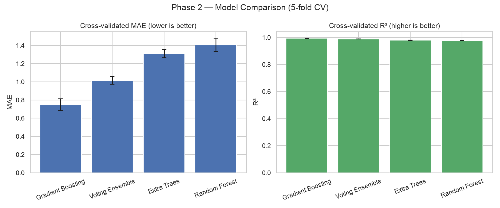
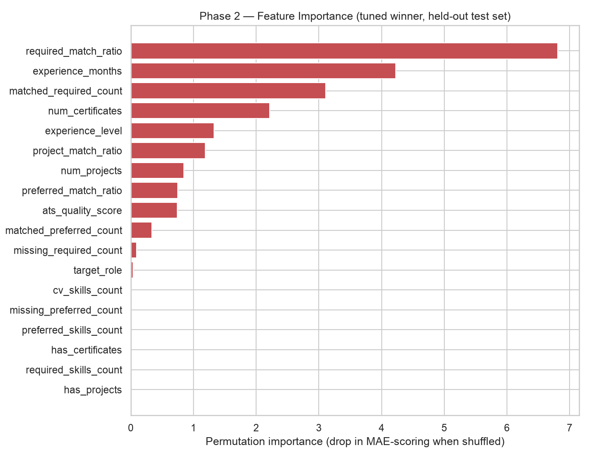
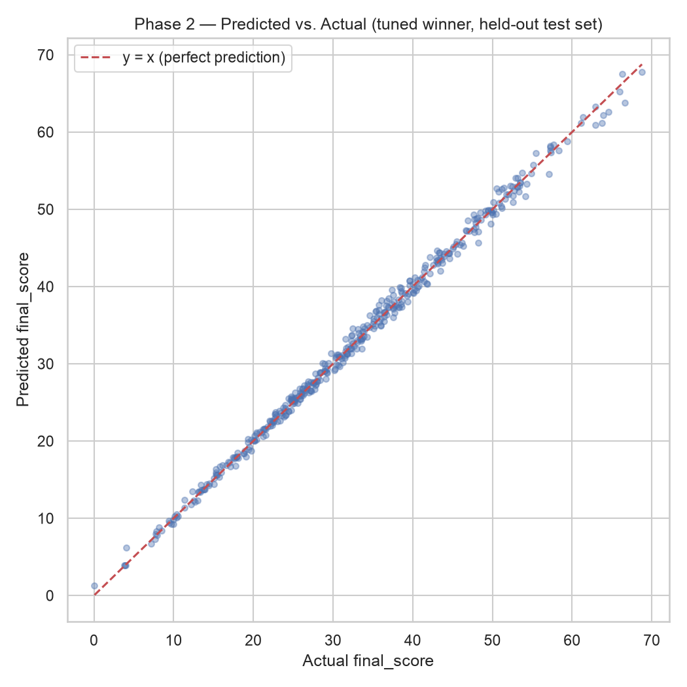

# Phase 2 — Algorithm Selection & Model Comparison

Supervisor feedback item addressed: **Algorithm Selection** — "Using only Random Forest; Random Forest alone is insufficient — experiment with Ensemble Models, Hybrid Models, and apply Hyperparameter Optimization to prepare a Model Comparison."

Full methodology and code: [`backend/compare_models.py`](../../backend/compare_models.py). Builds on Phase 1's labeled dataset ([`backend/Dataset/scored_training_dataset.csv`](../../backend/Dataset/scored_training_dataset.csv), 2,066 CVs). Status tracked in [`backend/models/model_registry.json`](../../backend/models/model_registry.json).

## Why this isn't about chasing a higher R²

As explained in [`TRAINING_GUIDE.md` §2.2](../../TRAINING_GUIDE.md) and [`IMPROVEMENT_PLAN.md`](../../IMPROVEMENT_PLAN.md), the training label (`final_score`) is a hand-written formula computed from the same features the model receives — not a real recruiter's decision. Any reasonably flexible model gets close to R² ≈ 0.98 on this label almost by construction, so "Algorithm Selection" here is about **robustness and having a legitimate, evidence-backed comparison** — exactly what this report provides — not about squeezing out the last fraction of R².

## Methodology

Four candidates, each wrapped in the same preprocessing (one-hot encoding for `target_role`/`experience_level`, passthrough for the 16 numeric features — identical to the currently-deployed model's preprocessing):

- **Random Forest** — `RandomForestRegressor(n_estimators=200)` — the current deployed baseline, unchanged, included as the control.
- **Gradient Boosting** — `HistGradientBoostingRegressor` — boosted trees, each new tree correcting the previous ones' errors.
- **Extra Trees** — `ExtraTreesRegressor(n_estimators=200)` — a more randomized bagging variant.
- **Voting Ensemble** — averages the three models above.

Each was scored with **5-fold cross-validation** on an 80% training split (not a single train/test split, so the numbers aren't luck-dependent on which 20% got held out) — mean ± standard deviation of MAE and R² across the 5 folds. The winner was then tuned with **`RandomizedSearchCV`** (20 iterations, 5-fold) and evaluated on the untouched 20% held-out test set for a final, honest number.

## Model comparison

| Model | CV MAE (mean ± std) | CV R² (mean ± std) |
|---|---|---|
| **Gradient Boosting** | **0.748 ± 0.065** | **0.9929 ± 0.0012** |
| Voting Ensemble | 1.015 ± 0.042 | 0.9876 ± 0.0010 |
| Extra Trees | 1.309 ± 0.045 | 0.9793 ± 0.0015 |
| Random Forest (current) | 1.406 ± 0.074 | 0.9775 ± 0.0021 |

Gradient Boosting wins clearly and consistently (low std across folds, not a fluke): **47% lower error than the currently-deployed Random Forest** (0.748 vs. 1.406 MAE).

## Tuning the winner

`RandomizedSearchCV` on `HistGradientBoostingRegressor` selected:

| Hyperparameter | Tuned value |
|---|---|
| `max_iter` | 300 |
| `learning_rate` | 0.1 |
| `max_depth` | 3 |
| `min_samples_leaf` | 30 |

**Held-out test set** (the 20% never used in any cross-validation fold or search):

| | MAE | R² |
|---|---|---|
| Original deployed model (v1, Random Forest, notebook) | 1.22 | 0.9851 |
| Phase 1 baseline (v1 hyperparameters, retrained on the new dataset) | 1.31 | 0.9839 |
| **Phase 2 winner (v2, tuned Gradient Boosting)** | **0.61** | **0.9966** |

## Feature importance

Computed via permutation importance on the held-out test set (works uniformly across all model types, unlike `.feature_importances_`, which `HistGradientBoostingRegressor` doesn't expose) — measures the actual drop in predictive accuracy when a feature is shuffled, not an internal split-count artifact.

`required_match_ratio` dominates, followed by `experience_months` and `matched_required_count` — the model is leaning on the same signals a human reviewer would (does the CV cover the role's required skills, and how much experience does the candidate have), which is a reasonable sanity check on top of the raw error numbers.

## Predicted vs. actual

Tight clustering around the y = x line across the full 0–70 score range, with no systematic bias toward over- or under-prediction at either end.

## Status

The tuned model is saved as **`backend/models/cv_job_score_model_v2.pkl`** (refit on the full 2,066-row dataset after tuning) and recorded in `model_registry.json` as `"status": "candidate, not yet deployed"`. **The live deployed model (`cv_job_score_model.pkl`) and `app.py` were not changed** — swapping `v2` into production is a Phase 6 integration decision, made deliberately separate from this comparison so the comparison itself stays an honest, unbiased evaluation.
