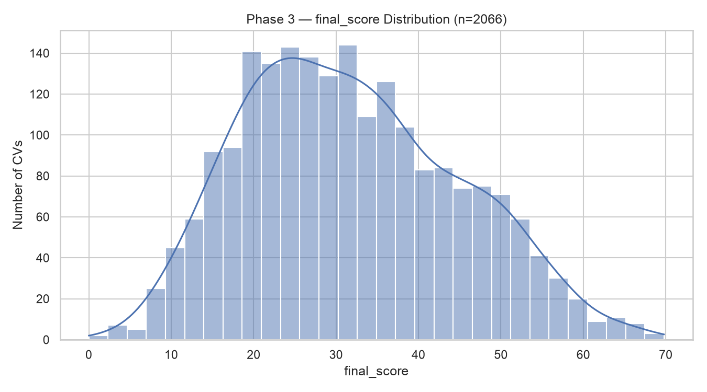
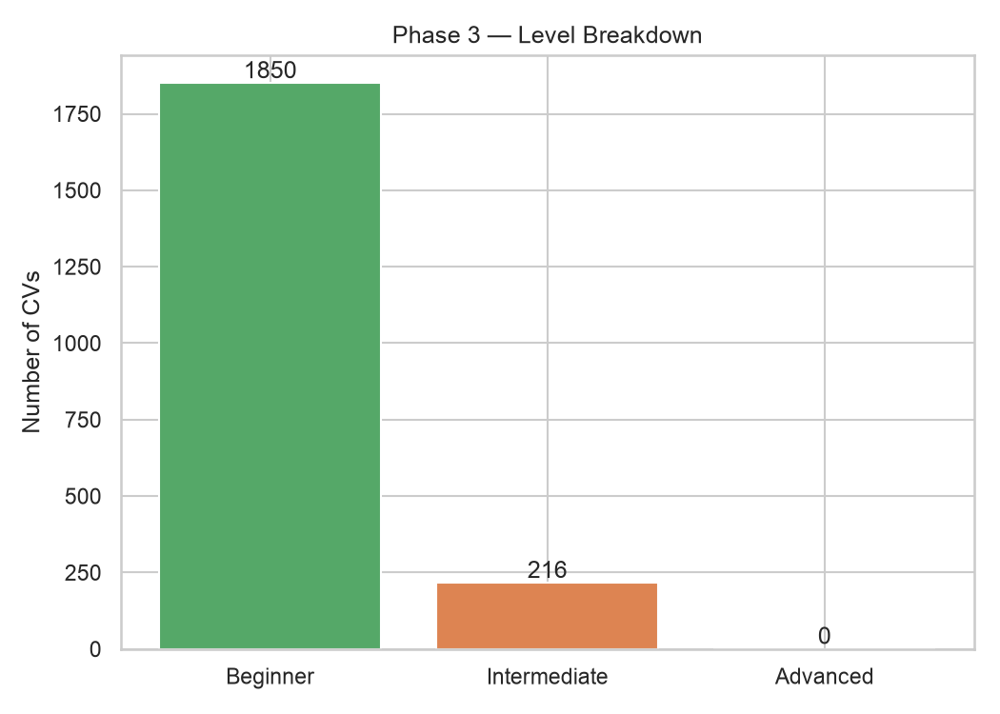
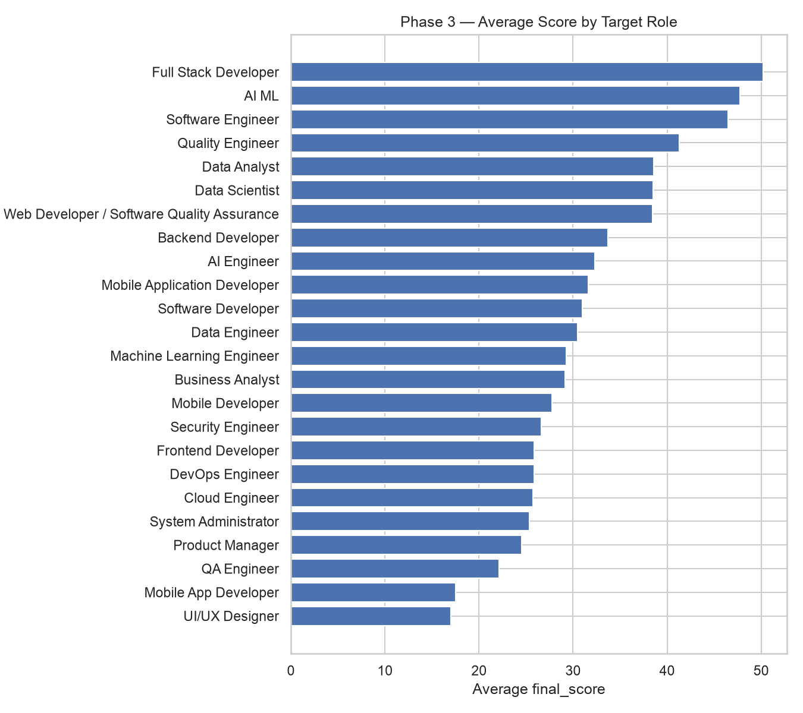

# Phase 3 — Data Visualization

Supervisor feedback item addressed: **Data Visualization** — "Basic numerical outputs → Incorporate appropriate graphs and charts to visualize matching performance and evaluation results."

This report covers the **evaluation results** half of that ask — the underlying dataset's score/level distribution and per-role averages. The **matching performance** half (model comparison — MAE/R² across candidates, feature importance, predicted-vs-actual) was already produced in [`../phase2-model-comparison/report.md`](../phase2-model-comparison/report.md) and isn't duplicated here.

Generated by [`backend/visualize_dataset.py`](../../backend/visualize_dataset.py) from Phase 1's `Dataset/scored_training_dataset.csv` (2,066 labeled CVs).

## Score distribution

Right-skewed, centered around 25–30, tapering off past 50. Consistent with the label formula (`TRAINING_GUIDE.md` §2) rewarding CVs that match a large share of a role's required *and* preferred skills, have relevant project experience, and meaningful tenure — most candidates in this dataset hit some but not all of those components.

## Level breakdown

**1,850 Beginner, 216 Intermediate, 0 Advanced** — shown honestly rather than omitted. `get_level` requires `final_score ≥ 80` for Advanced, but the highest score observed in the whole dataset is ≈70 (see the distribution above). This isn't a bug: `final_score`'s five components sum to a maximum of 100 only if a CV maxes out *every* component simultaneously (perfect required+preferred skill match, 3+ projects, 24+ months experience, 5+ certificates, and a perfect ATS score) — no CV in this dataset happens to do all five at once. Worth flagging to the supervisor as an observation about the label formula's practical range, not a modeling failure.

## Average score by role

Full Stack Developer, AI/ML, and Software Engineer candidates score highest on average; UI/UX Designer and Mobile App Developer lowest. This tracks the size/specificity of each role's required-skill list in `job_role_profiles.json` (broader, more common tech-stack roles are easier to match against) rather than any judgment about candidate quality per role — worth stating plainly if this chart is shown, so it isn't misread as "some roles attract worse candidates."
