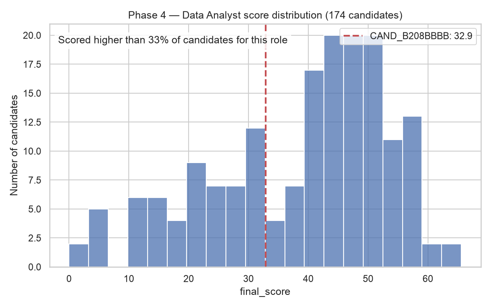
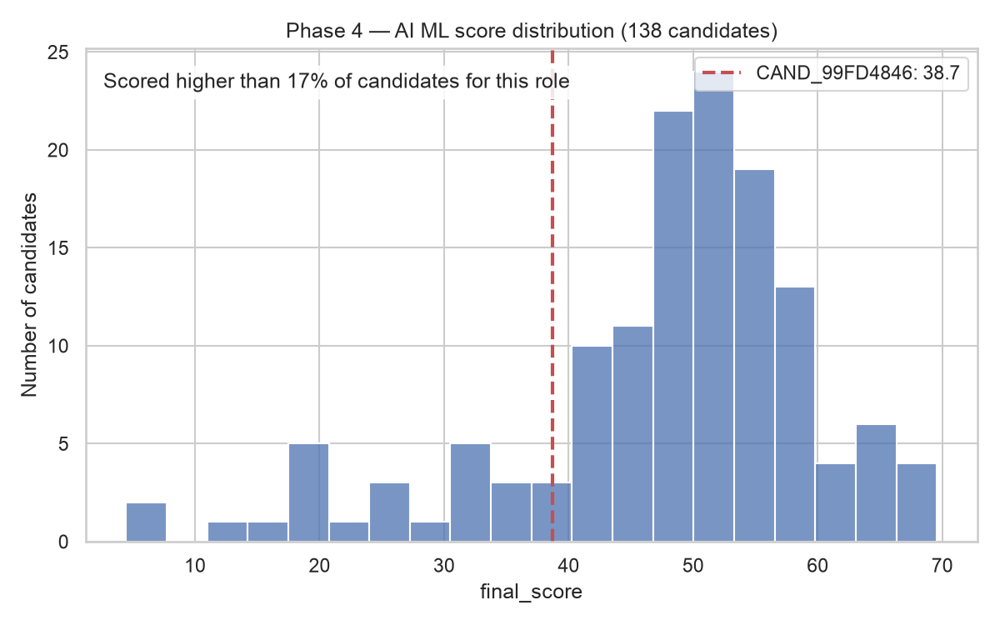

# Phase 4 — Relative Evaluation (percentile chart)

Supervisor feedback item addressed: **Relative Evaluation** — "Scoring candidate qualifications individually → Account for relative candidate comparison (how a candidate with an 80% match compares against other applicants for the same role)."

Phase 4's core deliverable — a live `percentile`/`percentile_label` field on `/analyze`, `/analyze-cv`, and `/compare-job` — is documented in [`IMPROVEMENT_PLAN.md`](../../IMPROVEMENT_PLAN.md) Phase 4. This adds the missing visual: a chart of a role's score distribution with a candidate marked on it. Generated by [`backend/visualize_relative_eval.py`](../../backend/visualize_relative_eval.py).

## Example 1 — Data Analyst (174 historical candidates)

Candidate `CAND_B208BBBB` scored 32.9, landing in the lower-middle of a visibly **bimodal** distribution — a cluster of Data Analyst CVs around 10–30 and a second, larger cluster around 40–55. This candidate sits just below the gap between the two clusters — a concrete, visual answer to "how does this candidate compare," not just a bare number.

## Example 2 — AI ML (138 historical candidates)

Candidate `CAND_99FD4846` scored 38.7, at the 17th percentile — this role's distribution skews higher overall (most mass sits above 40), so the same absolute score lands at a noticeably lower percentile here than a similar score would for Data Analyst. This is exactly the point of relative evaluation: an absolute score alone doesn't say whether 38.7 is strong or weak without knowing what everyone else applying for the same role scored.

## A data-quality finding surfaced while building this

The originally-planned third example, `CAND_920D187A` (AI Engineer — the notebook's own running example elsewhere in this project), was **dropped from this report** because `Dataset/scored_training_dataset.csv` has only **1** CV labeled `target_role: "AI Engineer"`. A histogram of one point isn't a meaningful chart, and `percentile_for_score` correctly returns `None` for it (the `MIN_SAMPLES_FOR_PERCENTILE = 5` guard in `utils/relative_eval.py` working as designed) rather than reporting a misleading "0%" or "100%".

Checking the full breakdown, **18 of the 24 roles have solid sample sizes (93–174 CVs)**, but **6 roles have only 1–2 CVs each**: `AI Engineer` (1), `Software Developer` (2), `Web Developer / Software Quality Assurance` (1), `Quality Engineer` (1), `Mobile Application Developer` (1), `Mobile App Developer` (1). These look like near-duplicate/synonym role labels that split what should likely be one bucket into several (e.g. `Mobile Developer` has 103 CVs while `Mobile Application Developer` and `Mobile App Developer` each have 1 — almost certainly the same role, labeled inconsistently in the source data). Worth flagging to the supervisor as a data-cleaning opportunity for a future iteration — consolidating these role labels before the next retrain would give all 24 roles a meaningful percentile, not just 18.
