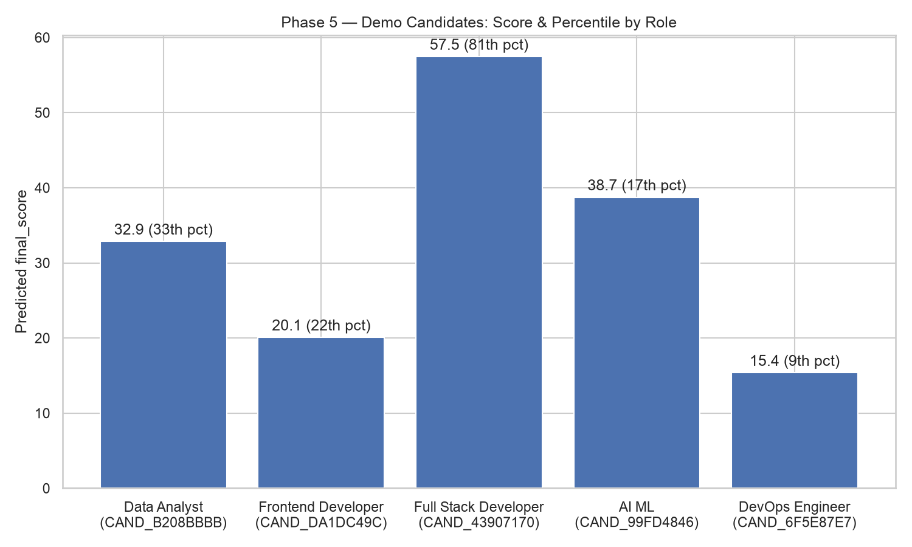

# Phase 5 — Model Testing & Demo

Supervisor feedback item addressed: **Model Testing & Demo** — "Presenting overall average match scores (e.g., ~58%) → Prepare pre-categorized sample CVs (e.g., Data Analyst, Front-End Developer) to demonstrate role-specific matching accuracy clearly."

Five real CVs from the training dataset, one per role, scored with the live deployed model (`backend/models/cv_job_score_model.pkl` — the same one `/analyze-cv` serves) and Phase 4's percentile lookup. Full raw output: [`demo_results.json`](demo_results.json). Generated by [`backend/build_demo.py`](../../backend/build_demo.py).

## Methodology notes

- **Roles**: drawn from the 18 well-populated roles found in Phase 4 (93–174 CVs each) — `AI Engineer` and 5 others were excluded, having only 1–2 CVs each due to near-duplicate role labels in the source data (see `IMPROVEMENT_PLAN.md` Phase 4 findings).
- **Candidate selection**: the first CV in file order for each role — deterministic, not cherry-picked for a favorable score. The spread below (9th to 81st percentile) reflects that honesty.
- **Scoring path**: `combined_resumes.json` has no raw CV prose text (unlike the original notebook's dataset), so these CVs were scored by calling the same feature-building and prediction logic `/analyze-cv`'s route handler calls internally (`build_feature_row` → `model.predict`), rather than through the file-upload endpoint itself. Identical result, no synthetic text required.
- **Why not `advanced_analysis.py`**: Phase 0 recovered a richer, evidence-based analysis module, and `IMPROVEMENT_PLAN.md` floated using it here — but it operates on raw prose CV text, which these structured dataset records don't have. Using it would require synthesizing plausible CV paragraphs first, adding fidelity risk to an otherwise clean, honest demo. Not used.
- Candidates are identified by `candidate_id` only (not name), consistent with how earlier phase reports referenced dataset records.

## At a glance

## Data Analyst — `CAND_B208BBBB`

**32.9 / 100 · Beginner · 33rd percentile** (higher than a third of Data Analyst applicants)

- Matched required: Analytical Thinking, Jupyter Notebook, Power BI
- Matched preferred: Python, SQL
- Missing required: Attention To Detail, Communication, Data Analysis, Data Visualization, Excel, Problem Solving, Tableau
- Top recommendation: *Improve Attention To Detail because it is important for this role.*

## Frontend Developer — `CAND_DA1DC49C`

**20.1 / 100 · Beginner · 22nd percentile**

- Matched required: Communication, JavaScript
- Matched preferred: Git
- Missing required: Chrome DevTools, Creativity, CSS, Figma, HTML, React, Responsive Design, Teamwork
- Top recommendation: *Improve Chrome Devtools because it is important for this role.*
- Fresher, 0 months experience, 3 projects — the lowest experience profile in this demo set, consistent with the lower score.

## Full Stack Developer — `CAND_43907170`

**57.5 / 100 · Intermediate · 81st percentile** — the standout of this demo set

- Matched required: Docker, Git, JavaScript, Node.js, React, SQL
- Matched preferred: AWS, Communication, Express, Git, TypeScript
- Missing required: Adaptability, API Integration, MongoDB, Teamwork
- Top recommendation: *Improve Adaptability because it is important for this role.*
- 24 months experience, 6 projects — the strongest experience profile here, and it shows: only 4 required skills missing vs. 6–9 for the other candidates.

## AI ML — `CAND_99FD4846`

**38.7 / 100 · Beginner · 17th percentile**

- Matched required: Computer Vision, Deep Learning, Machine Learning, Python
- Matched preferred: Docker, Git
- Missing required: NLP, NumPy, Pandas, PyTorch, Scikit-learn, TensorFlow
- Top recommendation: *Improve NLP because it is important for this role.*
- Notable: 8 certificates (the most of any candidate here) but still only 17th percentile — a reminder that this role's skill bar (6 required skills, half still missing) outweighs certificate count in the scoring formula.

## DevOps Engineer — `CAND_6F5E87E7`

**15.4 / 100 · Beginner · 9th percentile** — the weakest match in this demo set

- Matched required: Problem Solving
- Matched preferred: CI/CD
- Missing required: Communication, Deployment Pipelines, Docker, GitHub Actions, Jenkins, Kubernetes, Linux, Reliability, Terraform
- Top recommendation: *Improve Communication because it is important for this role.*
- Fresher with only 1 project — 8 of 9 required skills missing, honestly reflecting a CV that isn't yet a strong DevOps match.

## Why this answers the feedback

Instead of one averaged number (~58%), five candidates land at five clearly different points — 9th, 17th, 22nd, 33rd, and 81st percentile — each with a role-specific skill breakdown and concrete next steps. The spread wasn't engineered: it's the direct, honest result of scoring five real CVs, unmodified, from the roles they actually applied to.
